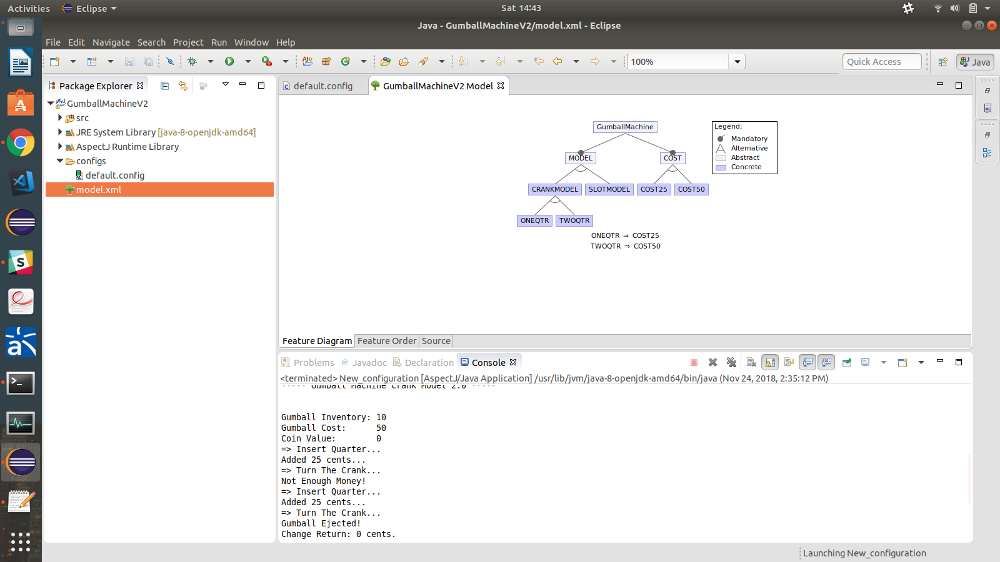
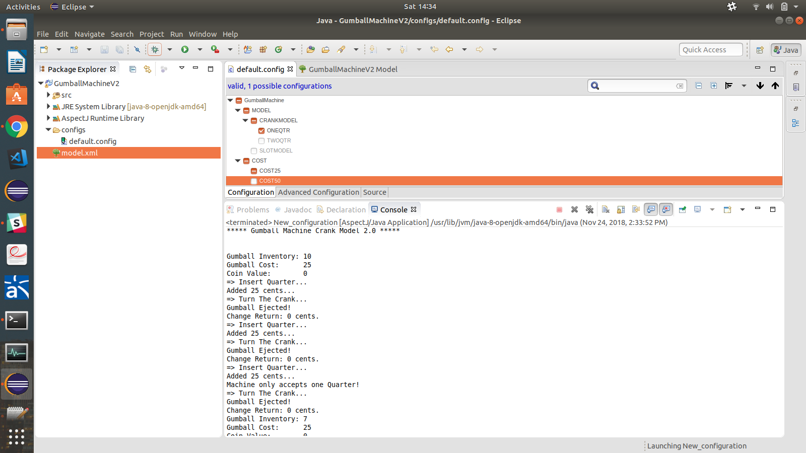
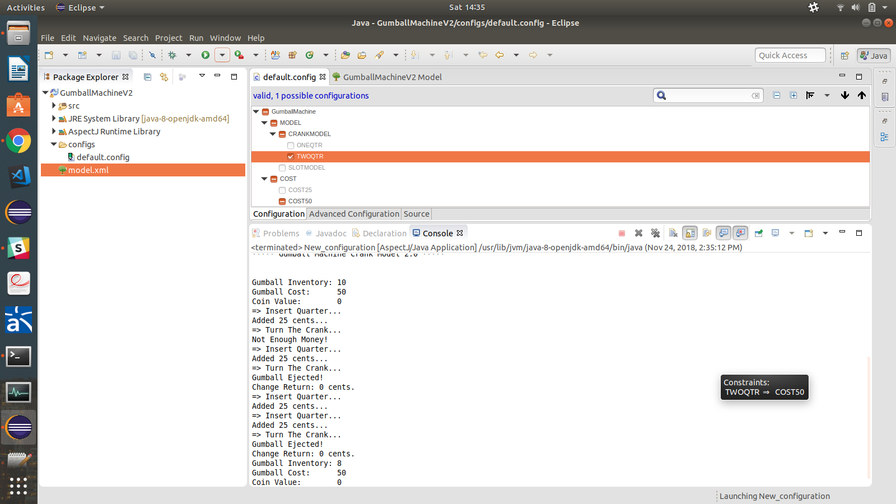
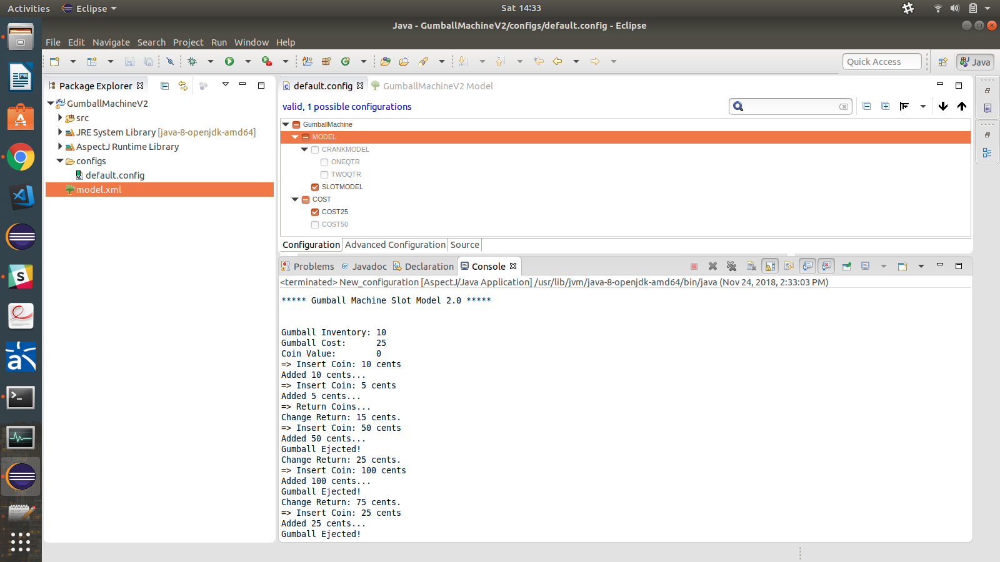
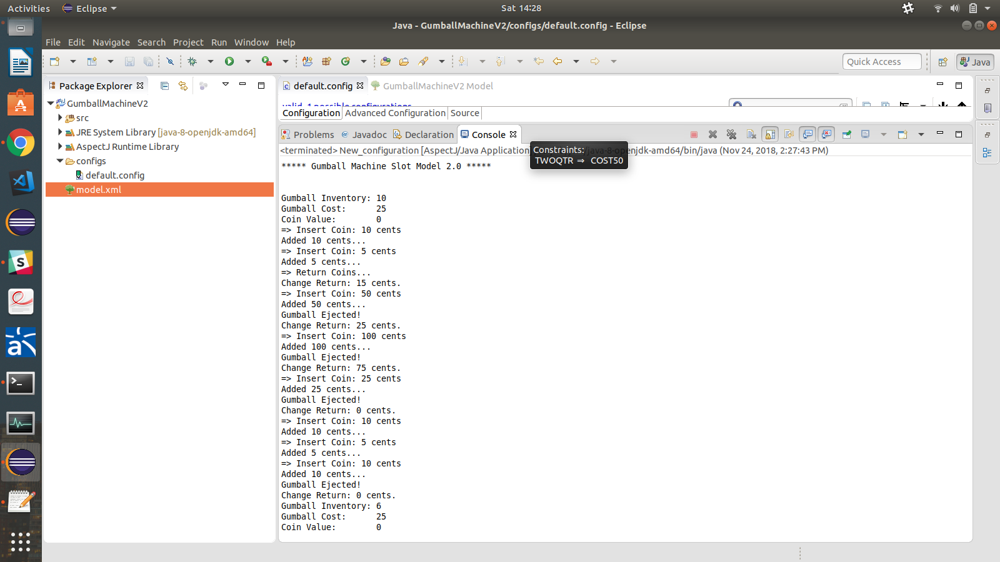
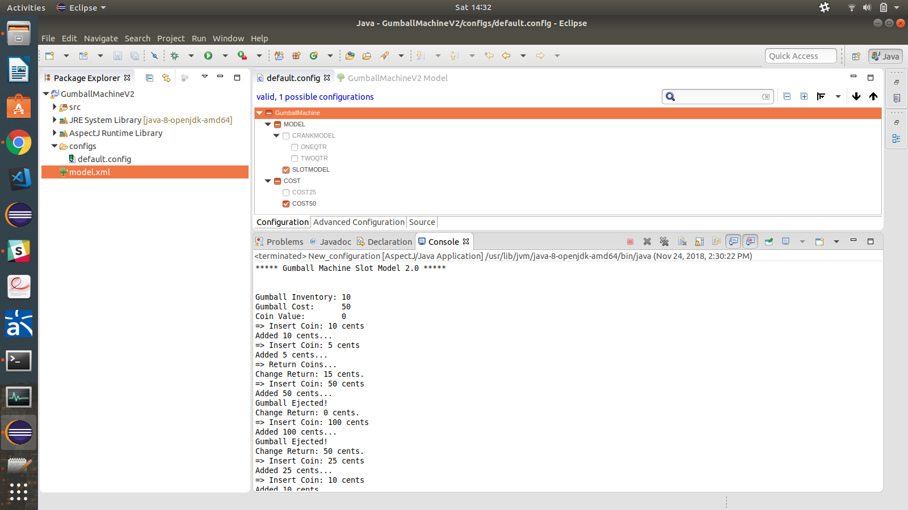
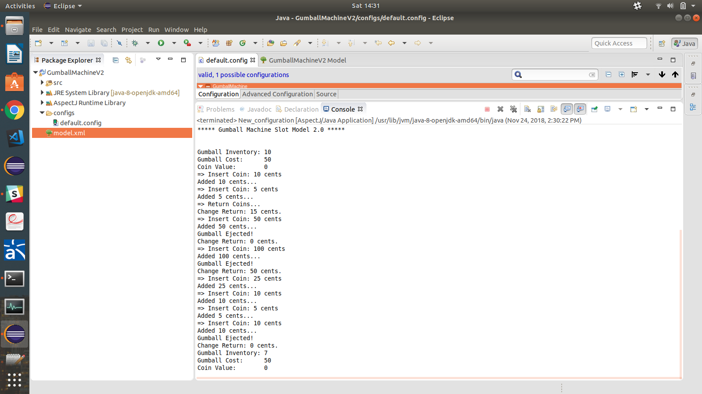

## Comparison of this solution with Lab 1

The solution I made for Lab1 was by having different objects of Gumball class for different machines, But as with this code of AspectJ we have set the values in config of which aspect file to be called it gets called and configures the machine accordingly

So in my solution if I had to make a Gumball machine accepting 2 quarters the contructor was to be called with coins accepted as 25 and cost of gumball as 50. Here we just select 2 quarters aj file and it handles everything as model.xml has code for it.

## Screenshots

